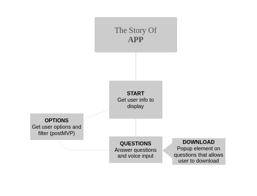

# Storyline

# Project Overview

## Project Links:

- [https://github.com/Willowmoon/Project-4]
- [https://www.figma.com/file/gECitRG59iFUrATFHWPQKK/The-story-of?node-id=0%3A1]

## Project Description:

    Accessible website that allows voice recording and saving of clips with the intention to send recordings to family members as keepsakes.

## Wireframes:




### MVP/PostMVP

#### MVP:

- Tell story when first entering site.
- Save voice recording answer.
- Allow users to go back and forward between questions.
- Make program incredibly accessible for older target audience.

#### PostMVP:

- Auto download answer after each question if button checked.
- Integrate Facebook chat or gmail to save recordings by sending to self.
- Login through Google or Facebook to save question currently on.
- Query options and custom tailor questions.
- Custom question option.

## Components:

| Component |                          Description                          |
| --------- | :-----------------------------------------------------------: |
| Index     | Give user introduction to the project and button to the start |
| App       |            Route the program and pull in API data.            |
| Prompts   |     Get users to answer question and save file afterwards     |

## Time Frame Matrix:

| Component                  | Priority | Estimated Time | Actual Time |
| -------------------------- | :------: | :------------: | :---------: |
| Questions/Options          |    H     |      5hrs      |    10hrs    |
| Voice Recorder Integration |    H     |      5hrs      |    15hrs    |
| Start Page                 |    H     |      3hrs      |    2hrs     |
| Accessibility              |    H     |     10hrs      |    8hrs     |
| API integration            |    H     |      8hrs      |    8hrs     |
| Hosting Backend            |    H     |      2hrs      |    2hrs     |
| Routing                    |    H     |      2hrs      |    2hrs     |
| CSS                        |    H     |     10hrs+     |    4hrs     |
| Animation                  |    M     |      3hrs      |    1hrs     |
| Theme Selection            |    L     |      3hrs      | incomplete  |
| Total                      |    -     |     48hrs      |    52hrs    |

## Model

```
[
    {
        "prompt": "Deep question about life 1",
        "option": "general/filter options"
    }
]
```

## Additional Libraries:

- [https://github.com/0x006F/react-media-recorder#readme] - Audo Recorder Package
