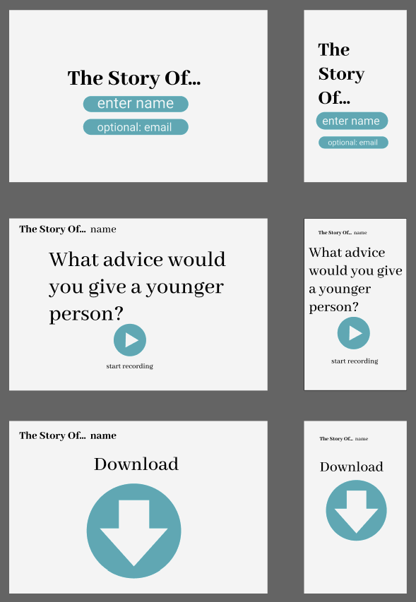
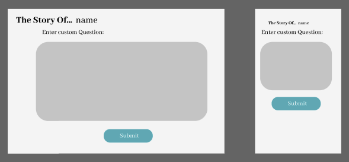

# Project Overview
## Project Links:
- [https://github.com/Willowmoon/Project-4]
- [https://www.figma.com/file/gECitRG59iFUrATFHWPQKK/The-story-of?node-id=0%3A1]

## Project Description:
    Accessible website that allows voice recording and saving of clips with the intention to send recordings to family members as keepsakes.

## Wireframes:



### MVP/PostMVP
#### MVP:
- Get user name and display in header.
- Save voice recording of answer with question specific name.
- Allow users to go back and forward between questions.
- Make program incredibly accessible for older target audience.

#### PostMVP:
- Auto download answer after each question if button checked.
- Integrate Facebook chat or gmail to save recordings by sending to self.
- Login through Google or Facebook to save question currently on.
- Query options and custom tailor questions.
- Custom question option.

## Components:
| Component | Description |
| --- | :---: |
| Start | Get users name and email(optional) or login through facebook/gmail integration |
| Options | Add querys and options to the API data being received. |
| App | Route the program and pull in API data. |
| Save | If the user wants to save the clip and send manually, through facebook or email. |
| Send | If the user wants to send the clip via email. Integrate email template and/or send by email functionality. |

## Time Frame Matrix:
| Component | Priority | Estimated Time | Actual Time |
| --- | :---: |  :---: | :---: |
| Questions/Options | H | 5hrs| hrs |
| Voice Recorder Integration | H | 5hrs | hrs |
| Start Page | H | 3hrs | hrs |
| Email/Local Saving | H | 3hrs | hrs |
| Custom Question | M | 3hrs | hrs |
| Accessibility | H | 10hrs | hrs |
| API integration | H | 8hrs | hrs |
| Hosting Backend | H | 2hrs | hrs |
| Routing | H | 2hrs | hrs |
| CSS | H | 10hrs+ | hrs |
| Animation | M | 3hrs | hrs |
| Theme Selection | L | 3hrs | hrs |
| Facebook or Google login | L | 10hrs | hrs |
| Total | - | 64hrs | hrs |

## Model
```
[
    {
        "prompt": "Deep question about life 1",
        "option": "general/filter options"
    }
]
```

## Additional Libraries:
- [https://github.com/danrouse/react-audio-recorder] - Audo Recorder Package